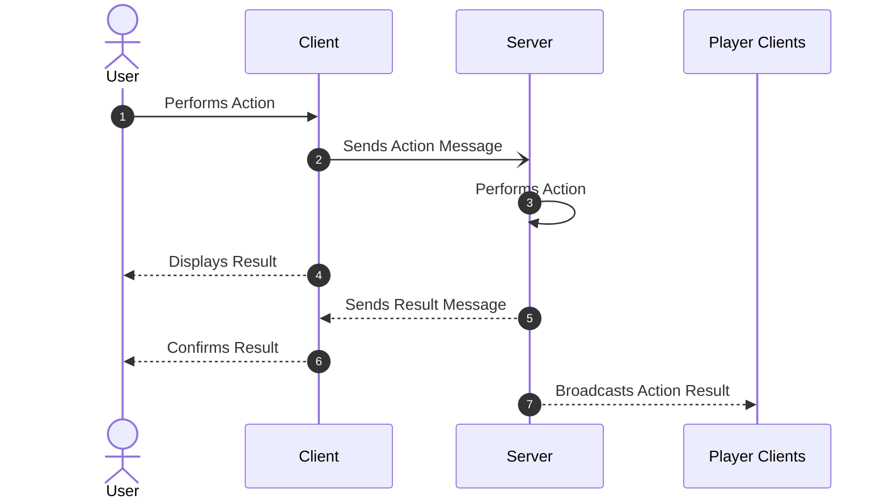

# Message Protocol Lib

The message protocol lib will define the common format of network messages between Client and Server for Crazy Eight Chaos.

## Glossary

* __Room__: a game session created in the server, where players can connect
* __Player__: a person who connects to a room using a game client
* __User__: a player that performs an action in the game client
* __Room Owner__: the player who created the room and acts as the manager of the room
* __Lobby__: state of a _room_ where the game is set up and waits for other players to connect
* __Play Field__: state of a _room_ where a match is being played

## Server Acknowledge

The Client will always send a message to the server after an action is performed by the user, and the server will acknowledge it if it is a valid action, broadcasting the result of the action to all other clients connected.

## Types of Messages

There are three major types of messages:
* __Action Message__: Sent by the Client of the user who performs an action
* __Result Message__: Sent by the Server to the client that performed the action. It either acknowledges the action as valid or rejects it.
* __Broadcast Action Result__: When a valid action is performed, the server will send a broadcast message to all other clients.

It should be noted that the result of an action can be broadcasted to all clients regardless if it is the client who originally sent the message or not. In this case, it will be up to the client to interpret the broadcasted message as the Result Message. The error message, in case of an invalid action or network error, should be only sent to the client that sent the action message.

Specific types of messages are shown below

### Connection Messages

These are messages than are fired when a player connection changes in the game room

* __Player connected__: broadcast player info to the lobby to update the player list in the client
  * Data broadcasted: Player Id and Player Name
* __Player disconnected__: broadcasts player id to remove it from the player list in the client
* __Room owner changed__: automatically assigned by server if current owner disconnects unexpectedly
  * Data broadcasted: the player id of the new owner of the room
* __Lobby code generated__: is a result message, only sent when Lobby owner connects to the lobby. Sends the code needed to connect to the room
  * Data received: the room code

With the exception of the last one, all other messages can happen at any time.

### Lobby Messages

These are messages that happen in the lobby of a client, ie, when the game is being set up and waiting for other players to connect. The messages that can happen are:

* __Rule Changed__: lobby owner enables or disables a rule, or changes the maximum number of players
  * Data sent: rule id and rule value
  * Data broadcasted: rule id and rule value
  * Invalid action on: rule id or rule value are invalid, or action not sent by a room owner
* __Deck Selected__: broadcasts the selected deck to use in the match
  * Data sent: deck id
  * Data broadcasted: deck id
  * Invalid action on: invalid deck id, or action not sent by a room owner
* __Player Ready state changed__: player sets if it is ready or not. Sends player id.
  * Data sent: ready status
  * Data broadcasted: player id and ready status
  * Invalid action on: invalid ready status
* __Player kicked__: player is kicked by the lobby. Sends player id.
  * Data sent: player id
  * Data broadcasted: player id
  * Invalid action on: invalid player id, or action not sent by a room owner
* __Player banned__: player is banned from the lobby. Sends player id.
  * Data sent: player id
  * Data broadcasted: player id
  * Invalid action on: invalid player id, or action not sent by a room owner
* __Start Game__: starts the game, ie, to change from lobby to play field.
  * Data sent: signal to change to match
  * Data broadcasted: signal to change to match
  * Invalid action on: not all players are ready, or action not sent by a room owner
* __Close Lobby__: Owner closes the lobby, all players are disconnected without the need to sent a disconnected action result.
  * Data sent: signal to request to close the room
  * Data broadcasted: signal to disconnect from room
  * Invalid action on: action not sent by a room owner
* __Change Owner__: performed by room owner when it wants to give the lobby to another player.
  * Data sent: player id
  * Data broadcasted: player id of new room owner
  * Invalid action on: invalid player id or action not sent by a room owner

### Game Messages

These are messages that happen in the play field of a client, when a game match is being played.

* __Set Turn order and first play__: broadcast to all players the turn order, who starts first, and the first card being draw from the deck
  * Data broadcasted: Turn order id, player id of who goes first, card id of the first drawn card. Follows card effect after that
* __Draw card__: broadcast message of the player who draws a card. This message will only sent the card being draw to the player that receives the card, all other clients don't receive that information. This includes the number of cards being drawn
  * Data sent: number of cards to draw. (It may be performer automatically at the start of a turn)
  * Data received: card hand id, card id in a list format
  * Data broadcasted: player id and number of cards drawn
  * Invalid action on: player can't draw card or invalid number of cards to draw
* __Play card__: message sent by the player who can play a card and chooses to do so. The player id and card hand id are sent
  * Data sent: card hand id
  * Data broadcasted: card id. It may follow a card effect
  * Invalid action on: player can't play a card or invalid card hand id
* __Card effect__: broadcast result action message that sends to the players the effect id of the card that has been played. Card effects messages can chain other messages if their end result requires to do so
  * Data broadcasted: card effect id (it may be tied to card id to automatically execute it)
* __Change turn__: automatically sent when the current player in turn has made a play. It sends the player id for the next turn. This is the  default broadcast result action message of cards with no effects
  * Data broadcasted: player id of next turn

#### Note
The card hand id, is a unique identifier to the card in the hands of the player. Those are unrelated to the real value of the card, only the server knows which card it is and confirms it only to the client that has the card. This is to prevent cheating by sending the card id in the message of a card that the player doesn't have